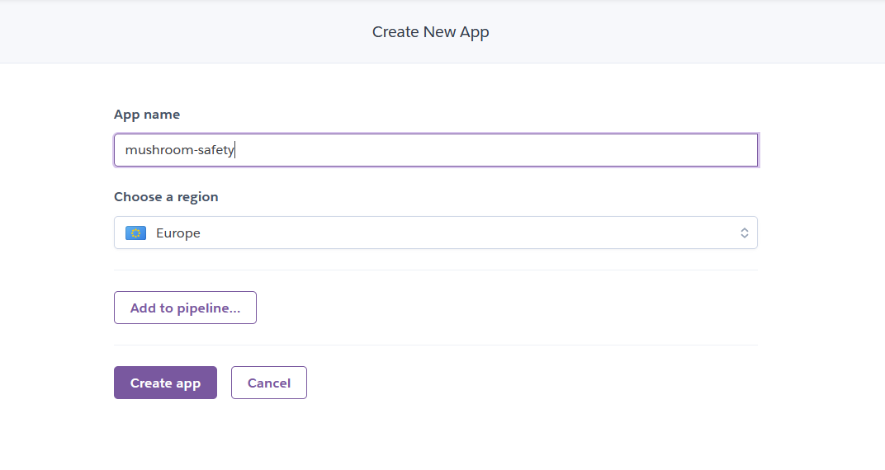

# **Mushroom Safety**

* [Live website](https://mushroom-safety-a3c88f9ac249.herokuapp.com/)
* [User Stories for Project](https://github.com/users/ocassidydev/projects/3/views/1)
* **Developed by Oran Cassidy July 2023**

## Table of Contents
  - [Summary](#summary)
  - [Dataset Content](#dataset-content)
    - [Project Terms and Jargon](#project-terms-and-jargon)
  - [Business Requirements](#business-requirements)
    - [Business Requirement 1 - Patterns in Dataset](#business-requirement-1---patterns-in-dataset)
    - [Business Requirement 2 - Prediction of Edibility](#business-requirement-2---prediction-of-edibility)
    - [Business Requirement 3 - Group Mushrooms](#business-requirement-3---group-mushrooms)
  - [Project Hypothesis](#project-hypothesis)
  - [Map of Business Requirements to Data Analytics Tasks](#map-of-business-requirements-to-data-analytics-tasks)
    - [Business Requirement 1](#business-requirement-1)
    - [Business Requirement 2](#business-requirement-2)
    - [Business Requirement 3](#business-requirement-3)
  - [ML Business Case](#ml-business-case)
    - [Predict Edible](#predict-edible)
    - [Cluster Mushroom](#cluster-mushroom)
    - [Classify Mushroom](#classify-mushroom)
  - [Dashboard Design](#dashboard-design)
    - [Page 1: Quick Project Summary](#page-1-quick-project-summary)
    - [Page 2: Mushroom Edibility Study](#page-2-mushroom-edibility-study)
    - [Page 3: Mushroom Edibility Detector](#page-3-mushroom-edibility-detector)
    - [Page 4: Project Hypothesis and Validation](#page-4-project-hypotheses-and-validation)
    - [Page 5: ML: Predict Edible](#page-5-ml-predict-edible)
    - [Page 6: ML: Cluster Mushroom](#page-6-ml-cluster-mushroom)
    - [Page 7: ML: Classify Mushroom](#page-7-ml-classify-mushroom)
  - [Unfixed Bugs](#unfixed-bugs)
  - [Deployment](#deployment)
  - [Data Analysis and Machine Learning Libraries](#data-analysis-and-machine-learning-libraries)
  - [Credits](#credits)
    - [Content](#content)
    - [Media](#media)
  - [Acknowledgements](#acknowledgements)

 

## Summary

<a href="https://mushroom-safety-a3c88f9ac249.herokuapp.com/">mushroom-safety</a> is a dashboard application that enables an wild mushroom harvesting business to analyse various properties of mushrooms to determine whether they are edible or poisonous. The project was agreed to achieve the following objectives for the company:

- gives the company visual insight into what aspects of mushrooms generally indicate if they are likely to be edible.
- allows the company to determine the probability a mushroom will be edible or not based on information that gan be gathered from visually categorizing the mushroom.
- allows the company to group similar mushroom types together.

[Back to top](#table-of-contents)

## Dataset Content
 

The dataset was sourced from the <a href="https://www.kaggle.com/datasets/uciml/mushroom-classification" target="_blank" rel="noreferrer">Mushroom Classification dataset</a> on <a href="https://www.kaggle.com" target="_blank" rel="noreferrer">kaggle</a>. Each row represents a mushroom, with each column representing physical attributes of the mushrooms, which include:

- The appearance of the <a href="https://en.wikipedia.org/wiki/Pileus_(mycology)">cap</a>, the structure that forms the head of the mushroom
- The bruising on the mushroom
- The mushroom's odor
- The appearance of the mushroom's <a href="https://en.wikipedia.org/wiki/Lamella_(mycology)">gills</a>, the structures that hang vertically under the cap
- The appearance of the mushroom's <a href="https://en.wikipedia.org/wiki/Stipe_(mycology)">stipe</a>, aka the stalk
- The appearance of the mushroom's <a href="https://en.wikipedia.org/wiki/Volva_(mycology)">volva</a>, aka the stalk root
- The appearance of the mushroom's <a href="https://en.wikipedia.org/wiki/Veil_(mycology)">veil</a>, the membrane that covers the cap and the stalk
- The appearance of the mushroom's <a href="https://en.wikipedia.org/wiki/Annulus_(mycology)">annulus</a>, the ring(s) that are seen on the stalk
- The mushrooms's <a href="https://en.wikipedia.org/wiki/Spore_print">spore print</a> color
- The mushroom's population, ie. how many of the same type were found in the area
- The habitat the mushroom was found in

| Variable                    | Meaning                                                                                     | Units                                                                                        |
| --------------------------- | ------------------------------------------------------------------------------------------- | -------------------------------------------------------------------------------------------- |
| class                   | Whether the mushroom is edible or poisonous                       | Character: 'e' - edible, 'p' - poisonous                                    |
| cap-shape | The shape of the mushroom's cap | Character: 'b' - bell, 'c' - conical, 'x' - convex, 'f' - flat, 'k' - knobbed, 's' - sunken |
| cap-surface | The consistency of the mushroom's cap surface | Character: 'f' - fibrous, 'g' - grooves, 'y' - scaly, 's' - smooth |
| cap-color | The color of the mushroom's cap | Character: 'n' - brown, 'b' - buff, 'c' - cinnamon, 'g' - gray, 'r' - green, 'p' - pink, 'u' - purple, 'e' - red, 'w' - white, 'y' - yellow |
| bruises | Whether the mushroom has bruises or not | Character: 't' - bruises, 'f' - no |
| odor | The mushroom's smell | Character: 'a' - almond, 'l' - anise, 'c' - creosote, 'y' - fishy, 'f' - foul, 'm' - musty, 'n' - none, 'p' - pungent, 's' - spicy |
| gill-attachment | How the mushroom's gills are attached to the stalk | Character: 'a' - attached, 'd' - descending, 'f' - free, 'n' - notched |
| gill-spacing | How the mushroom's gills are spaced out | Character: 'c' - close, 'w' - crowded, 'd' - distant |
| gill-size | The size of the mushroom's gills | Character: 'b' - broad, 'n' - narrow |
| gill-color | The color of the mushroom's gills | Character: 'k' - black, 'n' - brown, 'b' - buff, 'h' - chocolate, 'g' - gray, 'r' - green, 'o' - orange, 'p' - pink, 'u' - purple, 'e' - red, 'w' - white, 'y' - yellow |
| stalk-shape | The shape of the mushroom's stalk | Character: 'e' - enlarging, 't' - tapering |
| stalk-root | The shape of the stalk's root | Character: 'b' - bulbous, 'c' - club, 'u' - cup, 'e' - equal, 'z' - rhizomorphs, 'r' - rooted, '?' - missing |
| stalk-surface-above-ring | The consistency of the mushroom's stalk surface above the ring(s) | Character: 'f' - fibrous, 'y' - scaly, 'k' - silky, 's' - smooth |
| stalk-surface-below-ring | The consistency of the mushroom's stalk surface below the ring(s) | Character: 'f' - fibrous, 'y' - scaly, 'k' - silky, 's' - smooth |
| stalk-color-above-ring | The color of the mushroom's stalk above the ring(s) | Character: 'n' - brown, 'b' - buff, 'c' - cinnamon, 'g' - gray, 'o' - orange, 'p' - pink, 'e' - red, 'w' - white, 'y' - yellow |
| stalk-color-below-ring | The color of the mushroom's stalk below the ring(s) | Character: 'n' - brown, 'b' - buff, 'c' - cinnamon, 'g' - gray, 'o' - orange, 'p' - pink, 'e' - red, 'w' - white, 'y' - yellow |
| veil-type | The type of veil that the mushroom has covering the cap and stalk | Character: 'p' - partial, 'u' - universal |
| veil-color | The color of the mushroom's veil | Character: 'n' - brown, 'o' - orange, 'w' - white, 'y' - yellow |
| ring-number | The number of rings (annuli) on the mushroom's stalk | Character: 'n' - none, 'o' - one, 't' - two |
| ring-type | The type of ring (annulus) on mushroom's stalk| Character: 'c' - cobwebby, 'e' - evanescent, 'f' - flaring, 'l' - large, 'n' - none, 'p' - pendant, 's' - sheathing, 'z' - zone |
| spore-print-color | The color of the mushroom's spore print | Character: 'k' - black, 'n' - brown, 'b' - buff, 'h' - chocolate, 'r' - green, 'o' - orange, 'u' - purple, 'w' - white, 'y' - yellow |
| population | The number of mushroom's of the same type in the location it was found | Character: 'a' - abundant, 'c' - clustered, 'n' - numerous, 's' - scattered, 'v' - several, 'y' - solitary |
| habitat | The habitat the mushroom was found in | Character: 'g' - grasses, 'l' - leaves, 'm' - meadows, 'p' - paths, 'u' - urban, 'w' - waste, 'd' - woods |
| | | |

### Project Terms and Jargon
  - A mushroom describes any which has been picked by the company and physically classified using the above table of variables
  - Edibility describes whether a mushroom is edible or not, ie. is it not poisonous
  - A variable is any individual column in the above dataset that describes a mushroom, e.g. `odor`
  - Category is any possible value of each variable for a mushroom, e.g. `odor=none`

[Back to top](#table-of-contents)

## Business Requirements

A fictitious client for this project is a highly data-driven artisanal wild mushroom harvesting business that is seeking a reliable means to classify whether the Agaricus and Lepiota mushrooms they pick are edible or poisonous. They want to avoid selling toxic mushrooms to their customers, but also wish to avoid hiring expert mycologists to correctly identify mushrooms, and would prefer a cheap and reliable model to determine whether mushrooms are safe to eat. 

When a mushroom is picked, the picker will classify the mushroom based on it's physical characteristics, using set categories provided by the client. This information is logged, and then the mushroom is tested on cell cultures to determine if it is poisonous or not. Such toxicity screening is costly, and the client would rather replace this testing with a far cheaper alternative by leveraging predictive analytics on the considerable database of mushrooms they have already documented.

The client has shared a mushroom database containing information pertaining to the physical characteristics of the mushrooms and whether they were classed as edible or poisonous.

### Business Requirement 1 - Patterns in Dataset
- The client would like to better understand the patterns in the mushroom database so that the client can learn the variable categories of a mushroom most likely to be edible. This will help their picking team know what mushroom characteristics to look for and focus on picking.
- [User Stories](https://github.com/users/ocassidydev/projects/3/views/1) 1, 2, 6 and 7 are relevant to this requirement.

### Business Requirement 2 - Prediction of Edibility
- The client would like to determine whether a given mushroom is edible. It is essential that any means of doing this has a false positive rate of zero, as the client does not want to inadvertently sell poisonous mushrooms mistakenly identified as edible.
- [User Stories](https://github.com/users/ocassidydev/projects/3/views/1) 3, 6 and 7 are relevant to this requirement.

### Business Requirement 3 - Group Mushrooms
- The client has informed us that there are a number of distinct species of mushroom in the dataset. They want to investigate if this can be identified by grouping mushrooms with similar categories by means of a cluster algorithm, and to determine the rates of edibility among each identified cluster. Ideally, this will allow the picking team to identify certain categorical heuristics for selecting edible mushrooms.
- [User Stories](https://github.com/users/ocassidydev/projects/3/views/1) 4, 5, 6 and 7 are relevant to this requirement.

[Back to top](#table-of-contents)

## Project Hypothesis

- 1 - It's suspected that mushrooms with no odor are typically edible.
  - Viewing the rate of edibility among mushrooms with no odor, combined with a correlation study may be used to investigate this.
- 2 - It's suspected that mushrooms with a silky stalk surface consistency above their stalk ring are typically poisonous.
  - Viewing the rate of edibility among mushrooms with a silky stalk consistency above the stalk ring, combined with a correlation study may be used to investigate this.

## Map of Business Requirements to Data Analytics Tasks

- ### Business Requirement 1
  - **Data visualization and correlation study**
  - We will inspect the data related to the logged mushrooms.
  - We will conduct a correlation study (Pearson and Spearman) to understand better how the variables are correlated to edibility.
  - We will plot the main variables that correlate to edibility to visualize insights.

- ### Business Requirement 2
  - **Classification analysis**
  - We want to predict if a given mushroom will be edible or poisonous. We will build a binary classifier.

- ### Business Requirement 3
  - **Cluster analysis**
  - We want to investigate if there distinct groups of similar mushrooms by unsupervised learning.
  - When these distinct groups are identified, we want to build a classifier that can identify which group a mushroom belongs to.
  - We then wish to investigate if the rates of edibility among clusters of similar mushrooms, and find which variable categories most strongly predict the cluster a mushroom belongs to.

[Back to top](#table-of-contents)

## ML Business Case

### **Predict Edible**

#### Classification Model

- We want an ML model to predict if a mushroom is edible based on historical data from the mushrooms the client has logged. The target variable is categorical and contains 2 classes. We consider a **classification model**. It is a supervised, 2-class, single label, classification model with outputs of 0 (poisonous) or 1 (edible).
- The ideal outcome is to provide the picking team with reliable insight into the best profile of an edible mushroom for focusing on picking.
- The model success metrics: 
  - at least a precision of 1 for ediblility, on train and test set - ie. a false positive rate of zero
  - at least a recall of 0.9 for edibility, on train and test set - ie. a minimized false negative rate
  - The ML model is considered a failure if:
    - after 3 months of test usage, any newly picked mushrooms identified as edible come up as poisonous in a toxicity screen (even if model performs perfectly on the provided mushroom data, this will indicate what it has learned is not generalizable to a wider population of mushrooms)
    - after 3 months of test usage, more than 20% of newly picked mushrooms identified as poisonous come up as edible in a toxicity screen (don't want a model that discards too many perfectly edible mushrooms for no reason)
  - The model output is defined as a flag, indicating if a mushroom will be edible or poisonous and the probability they are edible. The picking team will have the dashboard available via their smartphones' web browser, enabling them to enter mushroom information in the field as they are collected. The prediction is made on the fly (not for batches).
  - Heuristics: There are no obvious heuristics for performing this task.
  - The training data to fit the model comes from the mushroom picking company. This dataset contains approximately 8000 logged mushrooms.
    - Train data - target: `class`; features: `cap-shape`, `cap-surface`, `cap-color`, `bruises`, `odor`, `gill-attachment`, `gill-spacing`, `gill-size`, `gill-color`, `stalk-shape`, `stalk-root`, `stalk-surface-above-ring`, `stalk-surface-below-ring`, `stalk-color-above-ring`, `stalk-color-below-ring`, `veil-type`, `veil-color`, `ring-number`, `ring-type`, `spore-print-color`, `population`, `habitat`

### **Cluster Mushroom**

#### Clustering Model

- We want an ML model to identify the various clusters that exist in the data to see if these correspond to distinct groups of mushrooms. We consider a **clustering model**, which is unsupervised. 
- The ideal outcome is to provide the client with reliable insight into whether the variables their pickers are collecting can identify similar mushrooms, and what are the rates of edibility among the clusters obtained.
- The model success metrics:
  - An average silhouette score of at least 0.5 among all clusters
  - The ML model is considered a failure if:
    - Distinct clusters are not successfully identified at the given mean silhouette score.
  - The output is defined as a flag, indicating which unlabeled cluster a mushroom belongs to. The picking team will have the dashboard available via their smartphone web browser, enabling them to enter mushroom information in the field as they are collected. The prediction is made on the fly (not for batches).
  - The training data to fit the model comes from the mushroom picking company. This dataset contains approximately 8000 logged mushrooms.
    - Train data - features: `class`, `cap-shape`, `cap-surface`, `cap-color`, `bruises`, `odor`, `gill-attachment`, `gill-spacing`, `gill-size`, `gill-color`, `stalk-shape`, `stalk-root`, `stalk-surface-above-ring`, `stalk-surface-below-ring`, `stalk-color-above-ring`, `stalk-color-below-ring`, `veil-type`, `veil-color`, `ring-number`, `ring-type`, `spore-print-color`, `population`, `habitat`

### **Classify Mushroom**

#### Classification Model

- We want an ML model to predict the cluster a mushroom belongs to **when we do not know if it is edible or poisonous**. The target variable is categorical and will contain the number of classes determined as suitable from Cluster Mushroom. We consider a **classification model**. It is a supervised, multi-class, single label, classification model, with integer outputs corresponding to each unlabeled cluster.
- The ideal outcome is to provide the picking team with a reliable method of identifying which clusters the mushrooms they pick belong to.
- The model success metrics:
  - An average recall of 0.7 among all clusters
  - The ML model is considered a failure if:
    - After 3 months of test usage, the model incorrectly assigns cluster labels to mushrooms more than 40% of the time.
  - The output is defined as a flag, indicating which unlabeled cluster a mushroom belongs to. The picking team will have the dashboard available via their smartphone web browser, enabling them to enter mushroom information in the field as they are collected. The prediction is made on the fly (not for batches).
  - The training data to fit the model comes from the mushroom picking company. This dataset contains approximately 8000 logged mushrooms.
    - Train data - target: `mushroom-cluster`(from Cluster Mushroom) features: `cap-shape`, `cap-surface`, `cap-color`, `bruises`, `odor`, `gill-attachment`, `gill-spacing`, `gill-size`, `gill-color`, `stalk-shape`, `stalk-root`, `stalk-surface-above-ring`, `stalk-surface-below-ring`, `stalk-color-above-ring`, `stalk-color-below-ring`, `veil-type`, `veil-color`, `ring-number`, `ring-type`, `spore-print-color`, `population`, `habitat`

[Back to top](#table-of-contents)

## Dashboard Design

### Page 1: Quick Project Summary

- Quick summary of the project
  - Project terminology
  - Description of the dataset
  - Business requirements, with some greater context the user can expand on

### Page 2: Mushroom Edibility Study

- Need this page to answer business requirement 1. Will need to display plots that correlate mushroom variables to edibility
- Agreed with stakeholders that this page will:
  - State business requirement 1
  - Checkbox: data inspection (displays the number of rows and columns in dataset, as well as first ten rows of data)
  - Displays most correlated mushroom variables to edibility with conclusions of study
  - Checkbox: Individual plots displaying edibility rates for each variable most correlated to edibility
  - Checkbox: Parallel plots mapping correlated variables to edibility for full visualization of how mushroom population breaks down

### Page 3: Mushroom Edibility Detector

- State business requirements 2 and 3
- Set of input widgets for setting the variables of the picked mushrooms. The inputs are related to ML pipelines that will predict edibility and the cluster the mushroom belongs to.
- "Run prediction" button that feeds the mushroom's data into the ML pipelines. These will predict the probability of whether the mushroom will be edible or poisonous, and which cluster of similar mushrooms they belong to, and whether this cluster tends to have poisonous or edible mushrooms, and at what rate.

### Page 4: Project Hypotheses and Validation

- We have two hypotheses regarding this dataset, which we will state and then display the results of testing them

* 1 - It's suspected that poisonous mushrooms have a foul odor
* 2 - It's suspected that poisonous mushrooms have a brown spore print color

### Page 5: ML: Predict Edible

- Considerations and conclusions after pipeline is trained
- Present ML pipeline steps
- Feature importance
- Pipeline performance

### Page 6: ML: Cluster Mushroom 

- Considerations and conclusions after pipeline is trained
- Present ML pipeline steps
- Feature importance
- Pipeline performance

### Page 7: ML: Classify Mushroom 

- Considerations and conclusions after pipeline is trained
- Present ML pipeline steps
- Feature importance
- Pipeline performance

[Back to top](#table-of-contents)

## Unfixed Bugs

- There is no known unfixed bugs in the project.

[Back to top](#table-of-contents)

## Deployment

### Heroku

- The App live link is: https://mushroom-safety-a3c88f9ac249.herokuapp.com/
- The project was deployed to Heroku from Github using the following steps.

1. Created account at [heroku.com](https://heroku.com)

See Image

2. Created an app with the name "mushroom-safety"

See Images

3. Ensured a Procfile with the line `web: sh setup.sh && streamlit run app.py` is in the main directory of the repo

4. Ensured all libraries used in the streamlit app page scripts are included in requirements.txt in the main directory of the repo

5. In the "Deploy" tab, under "Deployment method" selected "GitHub", which prompted the authorization from GitHub in a popup.

See Image

6. In the "Connect to Github" field, entered "mushroom-safety" for the repo name, clicked "search", and clicked "connect" for "ocassidydev/mushroom-safety"

See Image

7. On command prompt, ran `heroku login`, prompting the browser popup to authorize logging into the CLI

8. In the CLI, ran `heroku stack:set heroku-20 -a mushroom-safety` to set the stack to heroku-20.

9. Back in the "Deploy" section of the app dashboard, in the "Manual deploy" field, encured "main" was selected as the branch to deploy, and clicked "Deploy Branch"

See Image

10. Clicked "Open App" to access the application.

### Fork Repository 
To fork the repository, perform the following steps:

1. Go to the [GitHub repository](https://github.com/ocassidydev/mushroom-safety/tree/main)
2. Click the fork button in the upper right hand corner

### Clone Repository
To clone the repository, perform the following steps:

1. Go to the [GitHub repository](https://github.com/ocassidydev/mushroom-safety/tree/main)
2. Locate the Code button on the upper right hand corner
3. Select preference of cloning using HTTPS, SSH, or Github CLI, then click the copy button to copy the URL to the clipboard
4. Open Git bash
5. Change the working directory to where you wish to clone the repo to
6. Type `git clone` followed by pasting the URL from your clipboard
7. Hit enter to run the command and create the local clone

[Back to top](#table-of-contents)

## Data Analysis and Machine Learning Libraries

- The libraries used in this project:

	- `numpy` - for general usage on array-based data structures
	- `pandas` - for creating DataFrames to store the dataset in and operating various data cleaning, feature engineering, modelling and model assessment tasks
	- `matplotlib` - for plotting data to visualize insights
	- `seaborn` - for plotting data to visualize insights
	- `ydata-profiling` - for using the `ProfileReport` class to assess the datasets composition
	- `plotly` - for plotting parallel plots of mushrooms variables with respect to edibility
	- `ppscore` - for generating correlation coefficients of different variables in the dataset to the target
	- `streamlit` - for implementing the dashboard application
	- `feature-engine` - for various feature engineering tasks
	- `imbalanced-learn` - for performing SMOTE on the training data to ensure a balanced proportion of targets
	- `scikit-learn` - for implementing ML models
	- `xgboost` - for implementing ML models
	- `yellowbrick` - for assessing clustering model performance by visualizing silhouette scores
	- `category_encoders` - for using the `TargetEncoder` class to perform target encoding on the dataset

[Back to top](#table-of-contents)

## Credits

### Content

- The structure of this project draws heavily from Walkthrough Project 02 - Churnometer. Many of the functions for manipulating data stuctures, plotting, cross-validating and testing the models, and the python scripts for displaying the streamlit dashboard app, as well as the structure of the jupyter notebooks, take inspiration and largely borrow from it. However, I have modified code where appropriate and cut out unnecessary blocks that serve no function on this project, along with making numerous modifications were needed. I have also documented the functions in the project to demonstrate my working knowledge of their operation.
- [Stack Overflow](https://stackoverflow.com/) was used to answer various queries about how to use various libraries used in the project.
- [Towards Data Science](https://towardsdatascience.com) was used to refresh my understanding of various statistical concepts, and also to find the Target Encoding I used throughout the project. 
- The [Pandas Documentation](https://pandas.pydata.org/pandas-docs/stable/index.html) was consulted for various functionality in manipulating DataFrames.
- The [Scikit Learn Documentation](https://scikit-learn.org/stable/index.html) was consulted for understanding inputs for various classes and methods used in the project, notably the hyperparameters for my chosen classification algorithm. 
- The [Seaborn Documentation](https://seaborn.pydata.org/index.html) was consulted for understanding various plotting functions used in the project.
### Media

- The image at the top of this README was sourced from [Pinterest](https://www.pinterest.ie/pin/63894888434725002/)
- The diagram of a mushroom in this README and on the summary page of the dashboard was sourced from [Psychadelic Review](https://psychedelicreview.com/what-are-magic-mushrooms/)

[Back to top](#table-of-contents)

## Acknowledgements

I would like to acknowledge my assigned mentor, Mo Shami, who was very patient and helpful in assisting with the development of this project. I would also like to thank code institute's student care, who were very understanding of my circumstances when I needed more time to complete the project.

[Back to top](#table-of-contents)